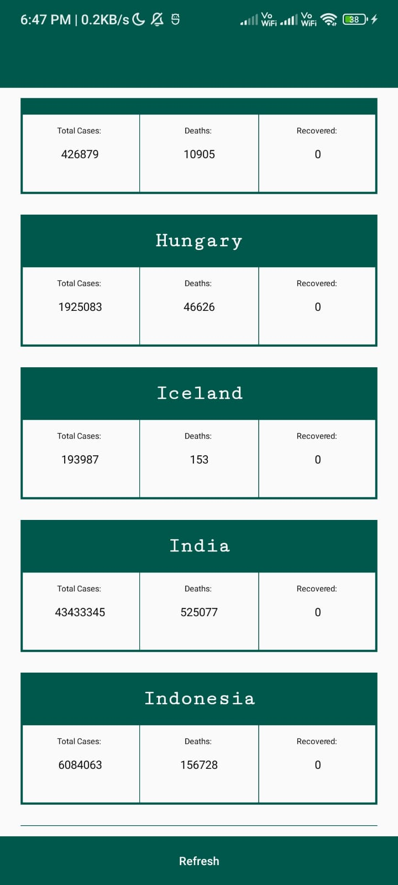

# Covid19Data

This project in an Android app which uses a Covid 19 data API to show the cases of Covid 19 of all countries. Volley library is used to get the APi data.

You can download the apk from this link: https://drive.google.com/open?id=1N4rYS-sj9xFc1P1AsQ2d-p5Ci52U6PQz

The app UI looks like this- https://drive.google.com/file/d/1HHL-AZMLzQ0F0N8BN3wDtePYtwRZVs21/view?usp=sharing

